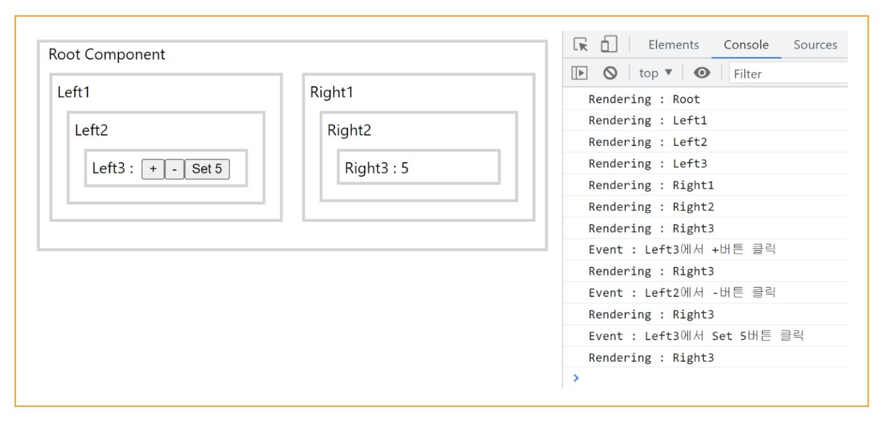

<h2 align="center">Redux Toolkit + Next.js ( Typescript )</h2>

<h3 align="center"> for example, study, boilerplate, whatever...</h3>
<br> 
<br>

## 📝 Table of Contents

- [About](#about)
- [Preview](#preview)
- [Code Overview](#code)
- [Run This Project](#run)
- [How To Init Redux Toolkit Project](#init)

( Toolkit을 쓰지 않는, Redux의 기본적인 사용법은 [endidj/redux-nextjs-typescript](https://github.com/endidj/redux-nextjs-typescript) 에서 참고해주세요. )
<br/>
<br/>

## 🧐 About <a name = "about"></a>

Redux Toolkit 를 Next.js( Typesciprt ) 프로젝트에 ,<br/>

1. 어떻게 적용하는지 ( How To Use ? ) <br/>
2. 어떤 현상이 일어나는지 ( What Happen ? )<br/>
   <br/>

## 👾 Preview <a name = "preview"></a>

- 모든 컴포넌트는 렌더링이 될 떄마다 콘솔에 찍힙니다.
- ( Redux의 효과 ) Left3의 + , - , Set 5 버튼을 눌렀을 때 <br/>
  Right3 컴포넌트만이 재렌더링 되는 것을 확인할 수 있습니다.
- 만약, props를 통해 상태 변경을 했다면, <br/>
상태가 전달되는 과정에서 다른 컴포넌트들이 재렌더링 됐을 것입니다.
<p align="center">
  
</p>

## 🐹 Code Overview <a name = "code"></a>

```
📦src
┣ 📂components
┃ ┣ 📜Left.tsx          // Redux 전역상태 변경
┃ ┗ 📜Right.tsx         // Redux 전역상태 구독
┣ 📂pages
┃ ┣ 📜index.tsx         // 메인 페이지
┃ ┗ 📜_app.tsx          // Redux Toolkit을 프로젝트에 적용
┣ 📂store
┃ ┣ 📂slices
┃ ┃ ┗ 📜counterSlice.ts  // Counter Slice
┃ ┗ 📜store.ts          // 전역상태 저장소
┗ 📂styles
┃ ┗ 📜globals.css
```

<br/>

## 🚀 Run This Project <a name = "run"></a>

의존 모듈 설치 ,

```
yarn
```

개발 모드 실행 ,

```
yarn dev
```

운영 모드 실행 ,

```
yarn build
yarn start
```

<br/>

## ⛏️ How To Init Redux Toolkit Project <a name = "init"></a>

프로젝트 생성 : Next.js ( typescript )<br/>

```
yarn create next-app project-name --typescript
```

Redux Toolkit 모듈 : React, Next.js와 호환되는 모듈

```
yarn add redux react-redux @reduxjs/toolkit
```

Redux 빌드타임 모듈 : 빌드시에만 사용할, 모듈 및 @types

```
yarn add -D @types/react-redux
```

<br/>

<!--
나중에 쓸 URL 포맷
## ⛏️ Built Using <a name = "built_using"></a>

- [MongoDB](https://www.mongodb.com/) - Database
- [Express](https://expressjs.com/) - Server Framework
  -->
